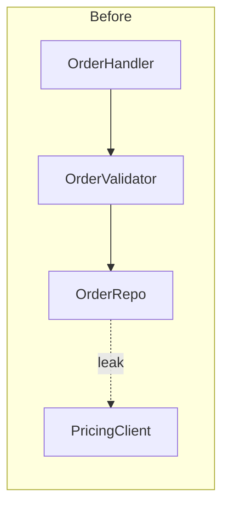
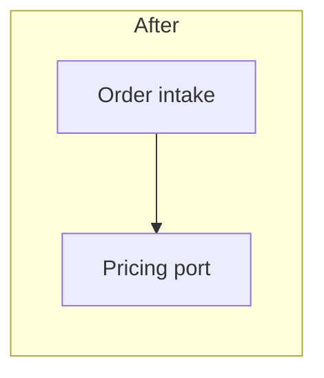
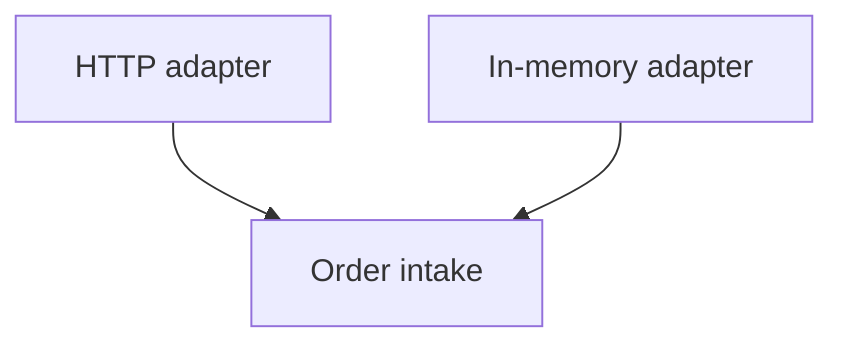

# Markdown report format

The architecture review is one self-contained `.md` file in the OS temp directory. Mermaid handles graph-shaped diagrams; prefer structured lists or simple ASCII mass/cross-section sketches when Mermaid fights the layout. No HTML, no CDN, no browser requirement.

## Scaffold

````markdown
# Architecture review — {{repo name}}

**Date:** {{ISO date}}
**Scope:** {{paths / subsystem / "hot spots from recent history"}}
**Legend:** solid box = module · dashed edge = seam · red/`-.leak.->` = leakage · thick/emphasized node = deep module

## Candidates

### 1. {{Title — names the deepening}}

**Strength:** Strong | Worth exploring | Speculative
**Seam kind:** in-process · local-substitutable · ports & adapters · mock
**Files:**

- `path/a.ts`
- `path/b.ts`

#### Before / after


````



#### Problem

One sentence. What hurts, in glossary terms.

#### Solution

One sentence. What deepens, not a full redesign.

#### Wins

- locality: bugs concentrate in one module
- leverage: one interface, N call sites
- delete 4 shallow wrappers

> **ADR:** contradicts ADR-0007 — reopen because {{reason}}

---

### 2. …

## Top recommendation

**{{Candidate title}}** — {{one sentence why first}}.

````

## Header

Repo name, date, scope, compact legend. No introductory essay — straight into candidates.

## Candidate sections

Diagrams and short fields carry the weight. Prose is sparse and uses the vocabulary from `SKILL.md` without ceremony.

Each candidate:

1. **Title** — short, names the deepening ("Collapse the Order intake pipeline").
2. **Strength + seam kind** — badges as plain bold text (Markdown has no color; reserve visual weight for Mermaid).
3. **Files** — monospaced paths.
4. **Before / after** — two Mermaid blocks, labeled. Pair them; don't merge into one overloaded chart unless the delta is a single rename.
5. **Problem / Solution** — one sentence each.
6. **Wins** — bullets, ≤~10 words each, glossary-grounded.
7. **ADR callout** — blockquote only when relevant.

No paragraphs of explanation. If the diagram needs a paragraph to land, redraw the diagram.

## Diagram patterns

Pick the pattern that fits. Mix them; same-shape every card reads as filler.

### Mermaid dependency / call flow

Use `flowchart` / `graph` when the point is "X calls Y calls Z — look at the mess." Mark leakage with a dashed edge and a `leak` label. Sequence diagrams work for "before: 6 round-trips; after: 1."

```mermaid
flowchart LR
  A[OrderHandler] --> B[OrderValidator]
  B --> C[OrderRepo]
  C -.leak.-> D[PricingClient]
````

```mermaid
sequenceDiagram
  participant H as Handler
  participant V as Validator
  participant R as Repo
  H->>V: validate
  V->>R: load
  R-->>H: row
```

### Call-graph collapse

Before: tree of small modules. After: one deep module node; former children listed as faded internals in a note or subgraph titled `internal`.

### Cross-section (layered shallowness)

Prefer a short Markdown stack over Mermaid when bands are the point:

```text
Before:  Handler > Validator > Mapper > Repo > Client > Formatter
After:   Order intake  (port: Pricing)
```

### Mass diagram (interface vs implementation)

Show shallow vs deep as two labeled bars:

```text
Before  interface ##############
        impl      ################

After   interface ###
        impl      ############################
```

### Ports & adapters

Two adapters on the after side makes the seam real:



## Writing rules for the report

- Prefer lists over tables (house style). A tiny metadata line is fine; don't build dashboard grids.
- Domain terms from the project glossary when present; architecture terms from `SKILL.md` always.
- Use exactly: module, interface, implementation, depth, deep, shallow, seam, adapter, leverage, locality.
- Never substitute: component / service / unit (for module), API / signature (for interface), boundary (for seam).
- Wins name the gain in those terms — not "easier to maintain" or "cleaner code."
- No hedging, no throat-clearing. If a sentence could be a bullet, make it a bullet. If a bullet can die, kill it.

Phrasings that fit:

- "Order intake module is shallow — interface nearly matches the implementation."
- "Pricing leaks across the seam."
- "Deepen: one interface, one place to test."
- "Two adapters justify the seam: HTTP in prod, in-memory in tests."

## Top recommendation

One short block: candidate name, one sentence why, optional anchor-style reference (`Candidate 1`) for long reports. No second analysis pass.
